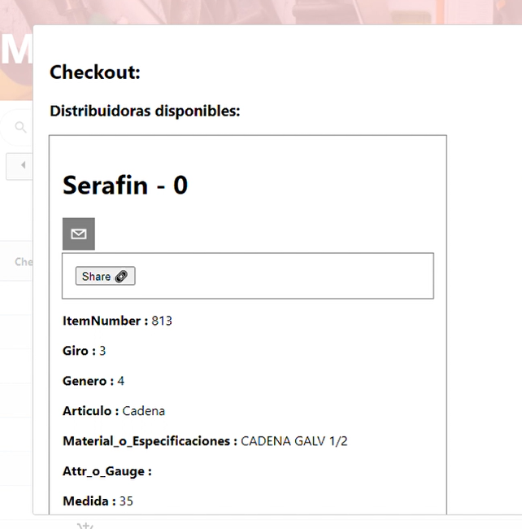
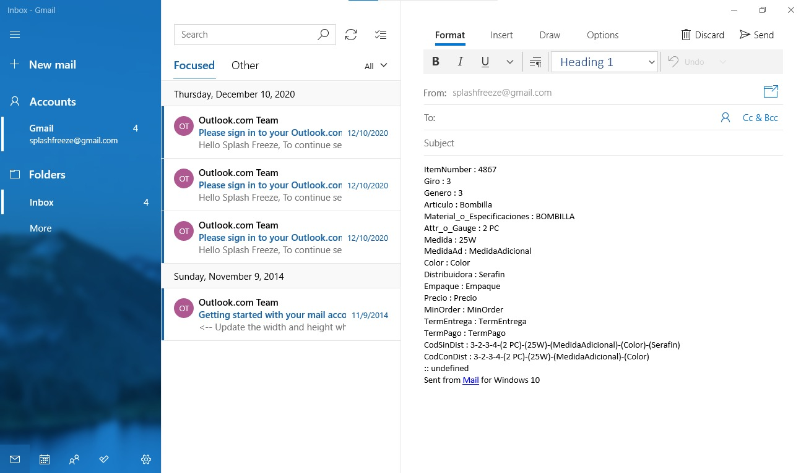

# Catalog Prototype Website

The point of this project was to provide the customer with a usable interface for finding different parts in a merchandise store. The backend used consisted of MySQL, and the frontend used ReactJS with some modules such as AG Grid, and Material UI, among others. The full list of depenencies can be found in the files. 

As can be seen, the main features of the website allow the user to search through the entire list of distinct products either by filtering through the upper level categories such as Ferretería (Hardware), then Ebanistería (Cabinetmaking), and finally Cadena (chain). Once the user reaches the third level (the actual product type itself), the different offerings from the distributors in the system will be shown. This is done by querying the MySQL database containing the information itself.

The information is then shown graphically using AG Grid, and some features are added, such as the Distribuidora column, which leads to a link to the distributor. Once the user sees the appropriate selection, the checkout button then leads to another popup which can provide even more detailed information to the user about the product.

Once there, the user can actually share the associated checkout information via email, which my client deemed useful enough to use, since any actual checkout integration with vendors is nonexistent in Puerto Rico due to a lack of modernization in the hardware industry.

